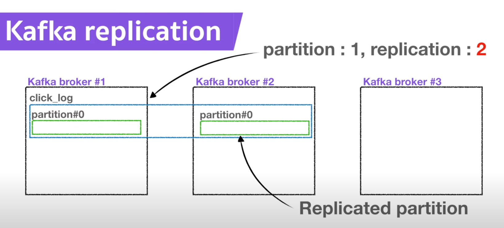
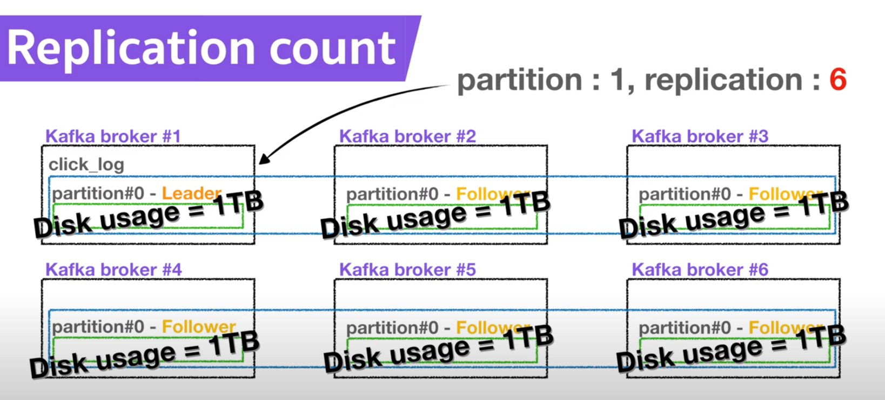
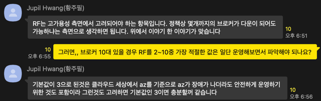

# Kafka Replication과 파티션 동기화

> Replication을 통한 파티션 복제와 이에 따른 장점과 단점을 알아보자

아래 그림은 3개의 Broker가 있는 상황에서 click_log라는 토픽을 생성한 예시이다. 
`--create --topic click_log --partitions 1 --replication-factor 2`

이 경우 2개의 파티션 중 하나의 파티션이 리더가 되고 나머지 파티션이 팔로워가 된다.

Producer가 발행한 이벤트는 Broker를 통해 리더 파티션으로 전송된다.
이후 리더 파티션은 받은 데이터를 팔로워 파티션에 전파하여 데이터 정합성을 유지한다.

Producer가 데이터 전송 후 응답을 받는 방법은 3가지로 acks 옵션을 통해 설정할 수 있다.
- `0` : 응답을 기다리지 않는다. (그래서 속도는 빠르지만 데이터 유실 가능성이 있다.)
- `1` : 리더 파티션에 데이터가 저장되면 응답을 받는다. 
- `ALL` : 리더 파티션이 모든 팔로워 파티션에 데이터를 전파 했을 때, 응답을 받는다. (안전하지만, 전송 속도는 느리다.)

#### [Kafka 3.0부터 acks 옵션의 기본값은 ALL이다.]

정리해보면 Replication을 사용하면 특정 Broker에 문제가 생겼을 때 다른 Broker에 있는 복제 파티션을 통해 데이터에 계속 접근할 수 있기 때문에 고가용성을 얻을 수 있다. 
(Replication-factor는 Broker의 총 수를 초과할 수 없다.)

그러면 Broker가 6개 있으면 무조건 `--replication-factor 6` 이렇게 최대로 높은 수의 복제 파티션을 가져가는 게 좋은 걸까? 아래 예시를 통해 알아보자

`--replication-factor`를 크게 설정하면 아래와 같은 단점들이 생긴다.
- 첫 번째, 같은 데이터를 여러 Broker에 저장해야 하므로, 전체적인 저장 공간이 많이 필요하다.
- 데이터를 여러 Broker에 복제하는 과정에서 발생하는 네트워크 트래픽이 증가한다.
- 모든 복제 파티션에 데이터가 성공적으로 저장되기를 기다려야 하므로(Kafka 3.0부터 acks=all이 기본값), 쓰기 작업의 지연 시간이 증가한다.

**결론은 일반적으로 사용되는 `replication.factor = 3`으로 설정하는 게 적절하다고 생각한다.** 
아래는 Confluent Korea 상무님의 의견이다.

---
---

#### [ Reference ]
- https://kafka.apache.org/documentation/#gettingStarted
- https://developer.confluent.io/courses/architecture/get-started/