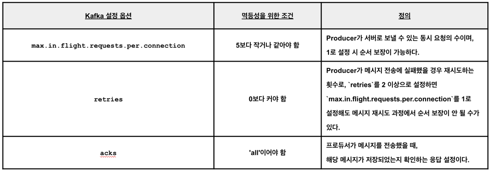

# Kafka 멱등성과 Exactly-Once

> Kafka 3.0부터 `enable.idempotence=true`가 default값으로 변경 되었다. 
> 이를 통해 Kafka에서 멱등성(idempotence)을 보장하며 정확히 한 번(Exactly-Once) 메시지를 전달할 수 있게 되었는데 이를 더 자세하게 살펴보자
> 
> 그리고 `acks=all`가 무엇인지 기억나지 않는다면 [2024.05.05 - Kafka Replication과 파티션 동기화](2024.05.05%20-%20Kafka%20Replication과%20파티션%20동기화.md)를 참고하자

Producer 설정에서 `enable.idempotence=true`로 설정함으로써 멱등성이 활성화된다.

좀 더 자세하게 설명하자면, `enable.idempotence = true`로 설정 시 Producer가 메시지 발행 시 Producer의 고유 식별자인 Producer ID (PID)와 함께 순차적으로 Sequence Number를 부여한다. 
이를 통해 특정 Producer가 중복 메시지를 보냈을 때, Broker가 PID와 Sequence Number를 통해 이미 받은 메시지임을 확인하고 추가 처리를 하지 않는다. 

그리고 `enable.idempotence`옵션을 활성화하기 위해서는 아래와 같이 조건을 지켜야한다.

---
---

#### [ Reference ]
- https://docs.confluent.io/platform/current/installation/configuration/producer-configs.html#enable-idempotence