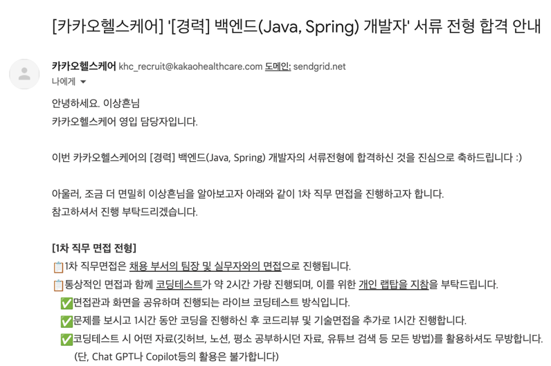
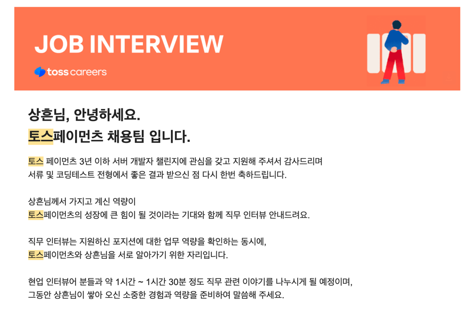

# 카카오 & 토스 면접 후기

> 2024년 5월에 진행했던 카카오 헬스케어와 토스 페이먼츠 면접에 대한 후기이다.

### 카카오 헬스케어

사실 면접을 보기 전 카카오페이에 다니고 있는 친구와 함께 "우리 같이 셔틀 버스 타고 출퇴근하면 좋겠다" 하면서 행복 회로를 돌렸었다 ㅎㅎ

하지만 내가 생각해도 라이브 코딩 테스트를 너무 못 봤다. 그래서인지 이후 코드리뷰 및 기술 면접 시간이 20분 지났을 때 면접관분들께서 더 질문할 게 없다고 하셨다. 
(당시 '면접 탈락 시그널'이라는 제목의 유튜브 영상에서 이와 비슷한 상황을 봤던 기억이 스쳐지나갔었다 ㅠㅠ) 

 

### 토스 페이먼츠

토스 페이먼츠 면접 또한 잘 보지 못했다. 하지만, 면접 이후에도 자꾸 생각나고 너무 너무 재밌었다!!

내 이력서에 작성한 프로젝트와 코딩 테스트 시 작성했던 시스템 디자인에 대한 서술형 답변과 관련된 질문이 주를 이루었고,
시스템 디자인 인터뷰를 본다면 이렇게 진행되겠구나~ 하는 생각이 드는 면접이었다.

- 왜 해당 기술을 선택했는지
- 그거 말고 다른 방법으로 설계한다면 어떻게 할 것인지
- 이러한 요구사항이 있을 때 너는 어떻게 설계할것인지

보통 면접을 보고 나서 잘 못 보면 "다 잊어버리고 다시 시작하자~" 이렇게 마음먹었다면, 이 면접을 보고 나서는 거의 일주일 동안 계속 더 나은 대답은 없었을까? 나는 왜 이걸 대답 못했을까? 등 계속 생각나고 찾아보며 성장하게 되는 면접이었다

기다려라 토스 언제가는 간다 ㅎㅎ