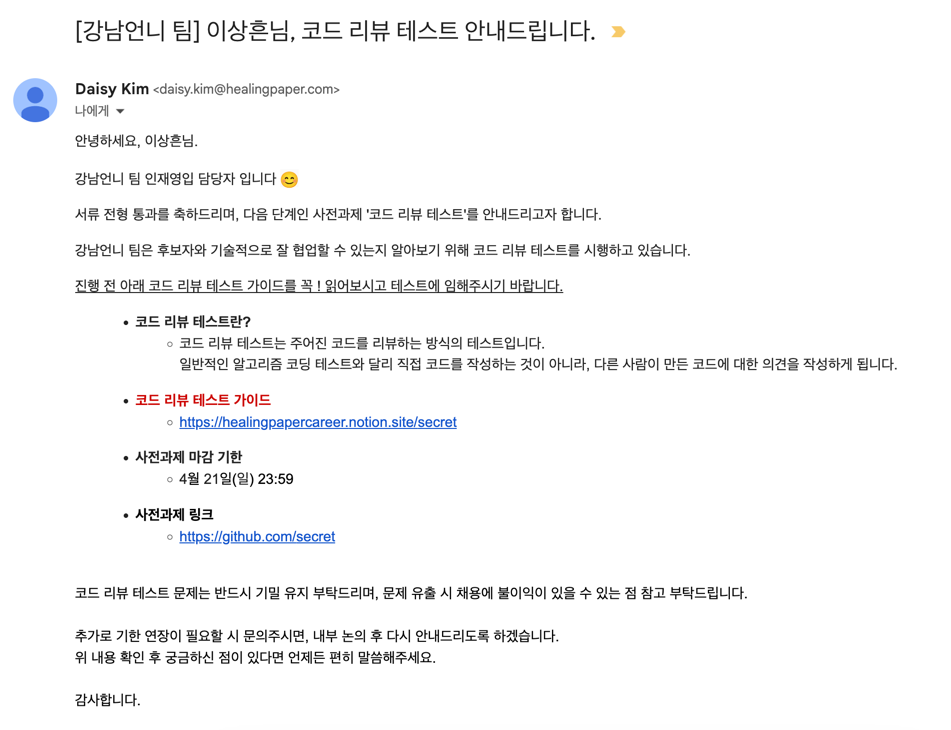

# 힐링페이퍼(강남언니) 코드 리뷰 테스트

> 2024년 4월에 진행했던 힐링페이퍼(강남언니)의 과제전형 '코드 리뷰 테스트'에 대한 후기이다.

기대하지 않았는데 서류 전형을 통과해서 과제 전형인 코드 리뷰 테스트를 진행하게 되었다. 
[[코드 리뷰 테스트란?]](https://blog.gangnamunni.com/post/code-review-test/)

코드 리뷰 테스트는 말 그대로 코드 리뷰를 하는 것이다.

나는 전 직장에서 코드 리뷰를 경험하지 못했기에 알고 지내던 친한 개발자들에게 "너희 회사에서는 코드 리뷰를 어떻게 해?", "말투는 어떻게 해?", "이모티콘도 사용해?" 등 다양한 질문을 통해 정보를 얻었다.

해당 정보를 바탕으로 나만의 코드 리뷰 스타일을 정하고 과제 전형을 진행했다.

##### 코드 리뷰를 달면서 고민한 것들
- 어떻게 하면 상대방이 기분 나쁘지 않게 작성할 수 있을까?
- 최대한 팩트만 전달할까? 그러면 너무 딱딱해 보이는데, 불편해하지는 않을까? 그렇다고 구구절절 길게 작성하기에는 가독성이 너무 떨어지는데?
- 정답이 없는 문제들(예: 네이밍)도 시험이니까 일단 내 개인적인 생각이라도 리뷰해야 할까?
- 칭찬도 넣어야 할까?

---

이 과제 전형을 진행하면서 느낀 점이 있다. 앞으로 이직하게 될 회사는 꼭 코드 리뷰를 하는 곳으로 들어가고 싶다는 생각이 들었다. 그동안 코드 리뷰 문화를 경험하지 못해서 단지 코드 리뷰가 무엇인지 알고 있는 정도였다. 하지만 이 과제 전형을 진행하면서, 내가 했던 것처럼 누군가가 내가 올리는 PR마다 리뷰를 달고 여러 동료들이 나의 코드에 대해 다양한 의견을 제시하는 것을 경험 해보고 싶다. 이를 통해 더 좋은 품질의 코드를 작성하게 되고, 서로의 성장을 위한 촉매가 되는 것이 바로 코드 리뷰 문화가 아닐까 생각한다.