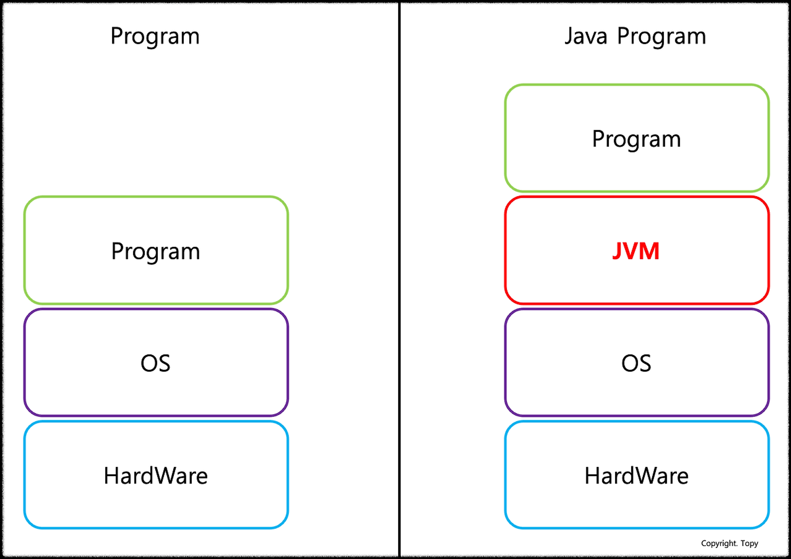
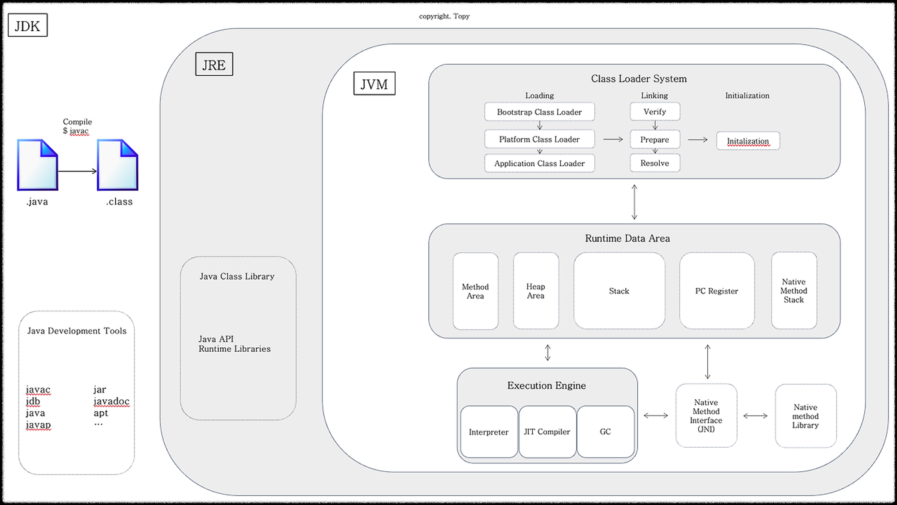
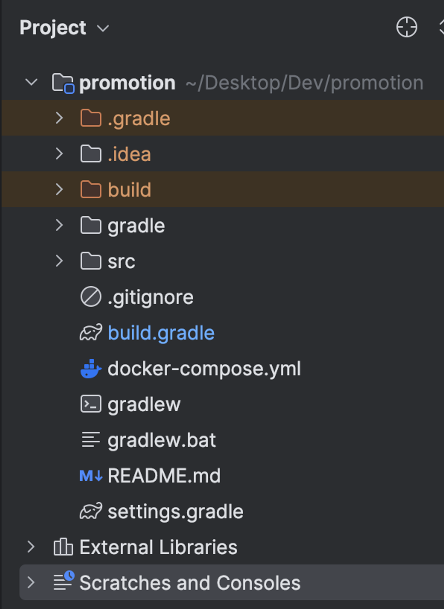

# JVM 클래스 로딩 및 코드 실행 과정

> #### Spring Boot 애플리케이션 실행 시 JVM이 어떻게 동작하는지 궁금해서 찾아봤다.

 

### JVM

우선 JVM은 위와 같이 OS위에서 실행된다.

Java 21기준 JVM 실행 시 아래와 같이 Heap Area에 메모리가 할당된다.
- Initial heap size of 1/64 of physical memory
- Maximum heap size of 1/4 of physical memory

**예시:** 
운영체제의 메모리가 16GB인 경우:

- 초기 힙 크기: 16GB / 64 = 0.25GB (256MB)
- 최대 힙 크기: 16GB / 4 = 4GB

### Compile

Intellij와 같은 idea 에서 .java 파일을 생성하고 코드를 작성한다.
이후 애플리케이션을 실행하면 .Java파일에 작성된 코드를 javac(Development Tools 중 하나인 컴파일러)가 컴파일해서 바이트코드로 구성되어 있는 .class를 생성한다. 
(이 과정을 컴파일이라고 한다.)

그렇게 컴파일을 하면 아래와 같이 build 디렉토리가 생성되고 그 하위에 .class파일이 생성된다. (Gradle의 경우)

### Method Area

이후 ClassLoader가 .class의 정보를 Method Area에 로드하는데 아래와 같은 경우에 로딩한다.
- 객체를 생성 (**`new`** 키워드)할 때.
- 정적 필드나 메소드를 처음으로 참조할 때.
- 리플렉션(Reflection)을 통해 클래스를 사용할 때.

그리고 저장되는 .class의 정보는 아래와 같다.
- `클래스 메타데이터`:
    - 클래스의 이름, 부모 클래스 정보, 인터페이스 정보 등 클래스 자체에 대한 메타데이터.
    - 메소드와 필드의 이름, 접근 제어자, 반환 타입, 매개변수 정보 등 메소드와 필드에 대한 메타데이터.
- `상수 풀 (Constant Pool)`:
    - 클래스 파일에 정의된 상수들(문자열 리터럴, 상수 값 등)을 저장하는 영역.
- `메소드 바이트코드`:
    - 메소드의 바이트코드 (실행 가능한 바이트코드 명령어들로 이거를 통해 인터프리터나 JIT컴파일러가 실행한다.)
- `정적 변수`:
    - 클래스 수준에서 선언된 정적 변수의 값.

### Heap Area

`new` 키워드를 사용하여 객체를 인스턴스로 생성하면 이때 Heap Area에 인스턴스가 저장된다. 
(해당 객체의 .class가 Method Area에 로드되어 있지 않는다면 로드 이후 Heap영역에 인스턴스를 저장한다. 그 이유는 JVM은 Method Area에 클래스 메타데이터가 없으면 클래스의 정보를 알 수 없기 때문)

### 코드 실행

특정 클래스의 메소드가 호출되면 JVM이 내부에 있는 JIT(Just-in-time) 컴파일러 또는 인터프리터가 Method Area에 있는 바이트코드를 사용해서 코드를 실행한다.

- `처음 실행` : Interpreter에 의해 실행된다. Interpreter는 바이트코드를 한 줄씩 해석해서 실행하기 때문에 실행이 빠르다. (다만 한 줄씩 해석하는 과정이 있어서 중복 실행 시 성능이 안 좋다.)
- `자주 사용되는 코드 실행` : JIT 컴파일러가 해당 클래스의 메타데이터(바이트코드)를 해당 사용자의 CPU가 이해할 수 있는 기계어로 컴파일해서 해당 기계어를 코드 캐시라는 캐시에 저장하고 실행한다.

---
---

#### [ Reference ]
- https://docs.oracle.com/javase/8/docs/technotes/guides/vm/gctuning/ergonomics.html#sthref5
- https://docs.oracle.com/javacomponents/jrockit-hotspot/migration-guide/comp-opt.htm#JRHMG117
- https://docs.oracle.com/en/java/javase/21/gctuning/ergonomics.html#GUID-DA88B6A6-AF89-4423-95A6-BBCBD9FAE781