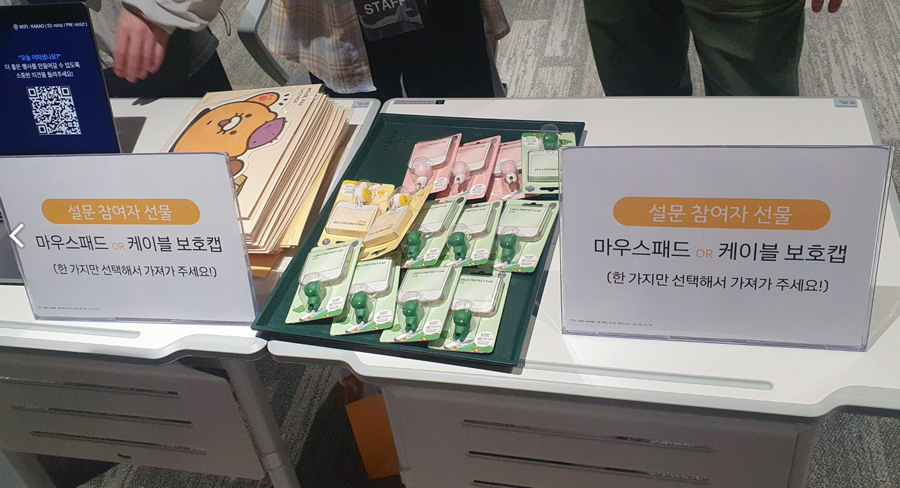

# 카카오 공개 기술 세미나 후기

> #### 사용하고 있던 [블로그](https://topyheun.tistory.com/9)를 닫기 위해 2023년 7월에 열렸던 제 2회 카카오 공개 기술 세미나를 다녀온 후기를 여기로 옮긴다.<br><br> 추가로 당시 만 7개월 차 개발자였던 내가 이해하지 못했던 Q&A 시간에 오고 갔던 질문과 대답을 현재의 나는 얼마나 이해하고 있는지, 그리고 질문에 대한 현재 나의 생각은 무엇인지를 정리해보려고 한다.

#### 신청 방법

아는 지인을 통해 제2회 카카오 공개 기술 세미나가 열린다는 소식을 듣게 되었다.


https://festa.io/events/3724<br>
위 사이트에서 신청을 했고 운이 좋아서 그런지 140명만 뽑는 세미나에 당첨되었다.

#### 신청한 이유


최근 나는 리팩터링에 대한 관심이 생겨 "Refactoring 2nd Edition"이라는 책을 구매했다.<br>
게다가 회사 업무 중 4 ~ 10만 개의 데이터를 ETL하는 로직이 있었고, 그 로직이 수동으로 돌아가고 있어서 Spring Batch를 적용하면 어떨까하는 생각을 하고 있었는데 우연히도 이와 관련된 주제를 다루는 것을 알게 되었다. ㅎㅎ

세미나 첫 번째 세션인 `리팩터링 발표` 자료는 앞서 언급한 책의 내용을 참고했다고 합니다. 자세한 레퍼런스는 아래 적어두었다.

- Refactoring 2nd Edition - 6.1 함수 추출하기 (158p)
- Refactoring 2nd Edition - 10.3 중첩 조건문을 보호 구문으로 바꾸기 (360p)

#### 세미나 후기
판교역 4번 출구로 나가는 길 바로 옆에 카카오 건물로 바로 들어갈 수 있는 입구가 따로 있었다. (역시 대기업)

<br>(세미나로 가는 길에 있는 귀여운 캐릭터 친구들)

카카오의 공개 기술 세미나는 오프라인 참석뿐만 아니라 Zoom을 통해 온라인으로도 시청할 수 있었다. 그러면 오프라인 참석자들과 온라인 참석자들의 차별점은 무엇이냐고 묻는다면, 두 가지 큰 장점이 있다.!

<p>
  
  
  
</p>

[ 오프라인 참석의 장점 두 가지 ]

- 첫 번째: 위와 같이 사은품을 받을 수 있다! (마우스 패드 or 케이블 보호 캡)
- 두 번쨰: 패널 토의를 참여할 수 있다! (세미나의 4번째 세션인 '패널 토의'는 온라인 생중계를 하지 않는다. 그래서 오프라인 참석자들만 '패널 토의'에 참여할 수 있었다. 세미나 내용은 추후 유튜브에 공개되지만, '패널 토의' 부분은 제외된다고 한다.)

#### 패널 토의

**※ 아래 Q & A 중 2년 차 개발자가 된 나는 질문에 대해 현재 어떻게 생각하는지 경험한 것들만 몇 개 코멘트를 남겼다.**

``` markdown
(Question)
리팩터링 작업과, 신규 요구사항을 개발하는 업무간의 우선순위를 조정하는 방법이 궁금합니다. 리팩토링의 중요성을 조직에 어필하는 좋은 방법이 있을까요?

(Answer)
프로토타입을 통해 예시를 보여주며 설득을 해야 하지만, 공감을 얻지 못한다면 버려질 수도 있다. 그리고 업무 시간이 아닌, 개인 시간을 활용해야 할 수도 있다.

(My Thoughts)
답변과 마찬가지로 1년 6개월 정도의 짧은 경력이지만 리팩터링을 위해 공수를 따로 받은 적은 없었다.
주니어 개발자다보니 업무가 널널할 때 회사에 남아서 리팩터링을 하곤 했었는데, 지금에서야 답변이 공감되는 것 같다

유명한 게임 전적 사이트를 운영하는 회사의 CTO분과 맥주를 마시며 이와 관련된 얘기를 한 적이 있다. "개인의 만족은 끝이 없기 때문에 리팩터링은 필요에 의해 해야 된다." 이 말에 너무 공감하고 동의하는 바이다.
```

``` markdown
(Question)
리팩터링 시 트레이드 오프가 있을 때 어떤 기준으로 판단을 내리는지 궁금합니다. 어떤 관점이나 기준을 가지고 리팩토링을 하나요?

(Answer)
코드가 길더라도 가독성과 테스트 용이성이 좋은 코드를 선호한다. 컴파일러가 읽고 수정하는 시간보다 사람이 읽고 수정하는 시간이 더 많기 때문이다.
```

``` markdown
(Question)
대용량 데이터를 배치, 병렬 처리 하면서 장애가 발생하면 어떻게 대응하시나요? 어떤 에러 처리나 롤백 메커니즘을 사용하셨는지 궁금합니다.

(Answer)
하나의 Chunk가 여러번 실행 되어도 계속 업데이트가 되지 않도록 방어로직을 취해야 한다. 롤백을 생각하는 것보다 배치를 계속 돌려도 문제가 없게 해야 된다.
```

``` markdown
(Question)
아직도 배치를 사용해야 하는지, 카프카 스트림즈 활용 등은 어떻게 생각하시는지 궁금합니다.

(Answer)
괜찮다고 생각한다. 하지만, 회사 내부 사정으로 도입하기엔 문제가 있다.
하지만, 특정 부분에서는 적용해볼만하다고 생각한다.

(My Thoughts)
위 질문과 답변은 지금 생각해보면 내가 질문을 제대로 못 들어서 이렇게 포스팅 한 것 같다.
왜냐하면 Batch는 정기적으로 대량의 데이터를 처리하는 것이고,Kafka는 실시간으로 데이터를 처리하는 것으로 알고 있다.
서로 성격이 다른데 저렇게 답변 하신 것을 보면 아무래도 내가 질문을 잘 못 이해하고 작성한 것 같다.
(당시에는 Kafka라는 단어를 처음 들어서 육성으로 들은 Kafka라는 발음을 듣고 무슨 단어인지 찾는 것도 오래걸렸었다. ㅎㅎ)
```

``` markdown
(Question)
리팩터링을 할 때 git 브랜치 관리는 어떻게 했는지 궁금합니다. 혼자 관리하는 프로젝트가 아니고 중간에 신규 기능 개발이나 수정을 하게되면 소스 충돌이 많이 발생할거같아서요.

(Answer)
금방 끝나는 작업이라고 생각하면 안 된다. 6개월 이상 걸렸던 경우도 있다. 의존성이 낮은 작업부터 천천히 시작하고 충돌은 당연히 발생한다. 그러므로 팀원들에게 충돌이 발생하면 나를 호출하라고 미리 말해주는 방법도 있다.
```