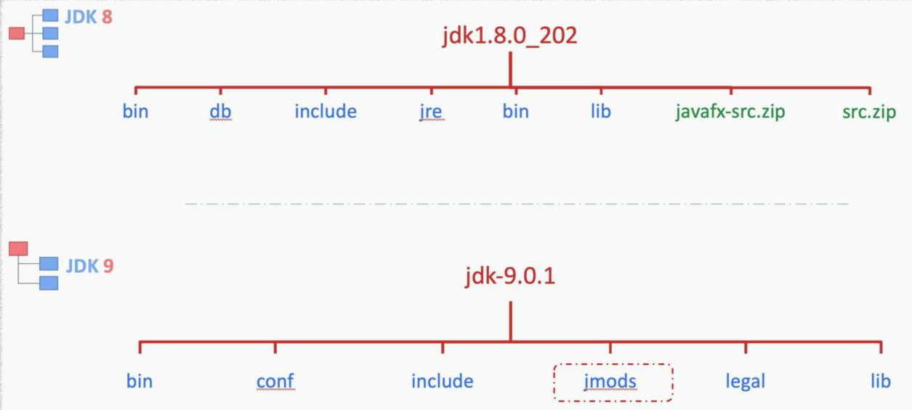
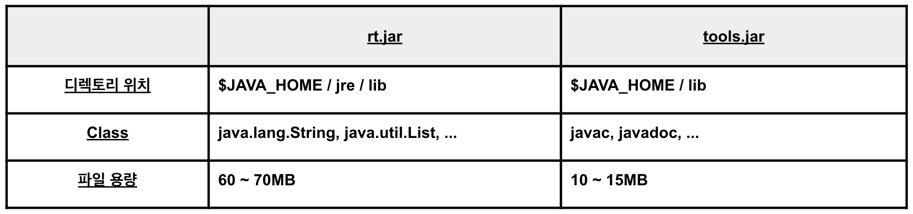

# Java 8과 Java 9의 차이, 알고 있어?

> #### Java8에서 Java9로 바뀌면서 어떤 점들이 바뀌었는지 알아보자.

 

#### 디렉토리 구조

Java 8 에서 Java 9 로 전환되면서 바뀐 가장 큰 변화는 모듈 시스템의 도입이다.

Java 9 부터 Java의 모듈화를 위한 장기 프로젝트인 Jigsaw를 통해 시스템을 모듈화하여 간결성, 성능, 보안 등을 향상시켰다. 그러면 지금부터 어떤 점이 바뀌었는지 살펴보자.

 (Java8, Java9 디렉토리 구조 비교)

Java 8과 이전 버전에서는 모놀리식 구조로 핵심 클래스들을 하나의 거대한 파일(.jar 파일형식)에 모아두었다.

여기서 말하는 핵심 클래스는 대표적으로 rt.jar 와 tools.jar가 있다. 이 두 개의 파일을 아래 표를 통해 정리해봤다.

과거 JVM은 위와 같이 큰 파일들을 로드해야 했기 때문에 성능에 부담이 있었다. 그래서 rt.jar와 tools.jar 파일을 제거했고, rt.jar와 tools.jar 파일에 들어 있던 클래스들을 100개 가량의 서로 다른 모듈(.jmod 파일형식)에 나누었다. 
※ .jmod : 모듈별로 클래스와 리소스, 네이티브 코드를 패키징하고 있는 파일입니다.

여기까지 읽었다면 "그러면 큰 파일을 여러개로 나누었다는 것 뿐이지 JVM이 로드해야 되는 양은 똑같잖아?" 라고 생각할 수 있다. 아래에서 이 궁금증을 해결해보자

 

#### 뭐가 달라졌을까?

앞에서 말한 것처럼 Java 8 버전에서는 JRE에 있는 Java 클래스 라이브러리에 rt.jar, tools.jar와 같이 큰 파일들이 존재했다.
이 파일들에는 여러 가지 클래스와 인터페이스 등이 포함되어 있었다. 
(예: java.lang 패키지의 String, Object, System, Exception 등).

그래서 애플리케이션 실행 시 JRE의 Java 클래스 라이브러리에 있는 큰 파일들 중 하나의 기능만 사용하려고 해도 전체 큰 파일을 JVM 안으로 로드해야만 했다. 
하지만, Java 9 부터는 JRE의 Java 클래스 라이브러리에 있는 큰 파일들이 모듈화 되었다.
(예: java.base.jmod, java.sql.jmod)

그 결과 Java 9 부터는 필요한 모듈만 로드 가능한 모듈 시스템이 도입되었다. 그래서 필요한 모듈만 JVM으로 로드되게 설정할 수가 있다.

모듈 시스템 설정을 하지 않으면 기본적으로 java.base 모듈만 추가되지만, 다른 모듈들을 사용하지 못하는 것이 아니다. 
예를 들어, `spring-boot-starter-data-jpa`와 같은 라이브러리를 추가하면, 해당 라이브러리가 내부적으로 java.sql과 같은 모듈들을 애플리케이션에 추가하는 방식으로 필요한 모듈들이 로드된다. 
이는 Gradle이나 Maven과 같은 빌드 도구가 클래스패스에서 필요한 모듈을 자동으로 관리해주기 때문이다.

---
---

#### [ Reference ]
- https://openjdk.org/projects/jigsaw/
- https://www.oracle.com/corporate/features/understanding-java-9-modules.html