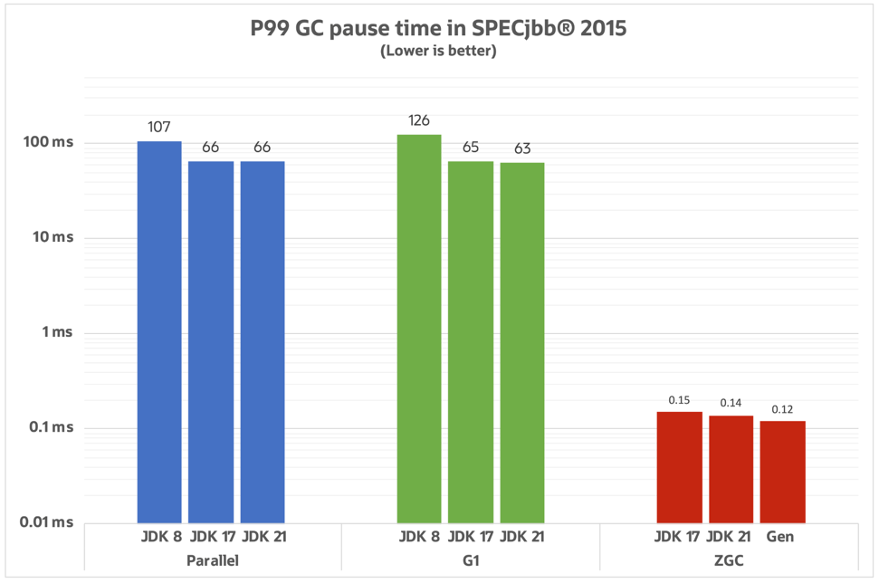

# Java 21의 새로운 GC, Generational ZGC: G1 GC와의 비교와 장점

> #### 10년차 개발자인 지인이 주니어 시절에 만든 소켓 서버에서 메모리 부족으로 OutOfMemoryError가 발생했던 이야기를 들었다. 당시 원인을 찾지 못해서 결국 리팩터링을 했고, 다행히 문제가 해결되었다고 한다.  물론 코드에 문제가 있었겠지,,, 하고 생각하지만, 문득 GC 성능이 좋다면 이런 문제도 해결해주지 않을까 하는 생각이 들었다. 그래서 여러 가지 GC를 찾아보다가 새로 나온 Generational ZGC를 알게 되었다.   사실 앞서 말한 스토리와는 크게 상관없지만 ㅎㅎㅎ 그냥 어쩌다 Generational ZGC에 꽂혀 글을 작성하고 있는지에 대한 의식의 흐름을 설명하고 싶었다. 

 

#### Heap Area를 논리적 구분 비교

**G1 GC**
- Heap을 일정 크기의 리전(region)으로 나누어 관리한다.

**Generational ZGC**
- Heap을 Young Generation과 Old Generation으로 구분하여 관리한다.

위와 같이 G1 GC는 Heap Area를 작은 크기의 리전(region)으로 나누어 관리하기 때문에 GC 실행 시간이 짧다. 이로 인해 STW(Stop-The-World) 시간이 상대적으로 짧아진다. 
❓ `STW(Stop-The-World)` : GC 과정 중 특정 단계에서 발생하며, 애플리케이션의 모든 실행 스레드를 일시 중지하고 특정 GC 작업을 수행하는 시간을 의미한다.

 

#### STW(Stop-The-World) 비교

우선 아래는 STW 비교 차트이다.

위 차트를 보면 G1 GC보다 Generational ZGC의 STW가 더 짧은 것을 알 수 있다. 
도대체 왜!! 어떻게!! 분명 앞에서 말하기를 "G1 GC는 Heap Area를 작은 크기의 리전(region)으로 나눠서 STW가 짧다고 했잖아!!" 이렇게 생각하고 있다면 일단 계속 읽어보자 ㅎㅎ

 

#### STW 시간이 짧은 이유 01: Load Barrier & Store Barrier

**Generartional GC는 아래와 같은 단계로 실행된다.(G1 GC도 거의 똑같다.)** 

1. `Initial Mark (STW)` : GC 루트에서 시작하여 살아있는 객체를 마킹한다.
2. `Concurrent Mark` : 애플리케이션 실행 중에 병행으로 객체를 마킹한다.
3. `Final Mark (STW)` : Concurrent Mark 동안 변경된 객체 참조를 처리한다.
4. `Concurrent Cleanup` : 불필요한 객체를 정리하고 메모리를 재활용한다.

GC(가비지 컬렉션)에서 특정 작업을 수행하기 위해 삽입되는 코드 조각을 Barrier라고 한다.
G1 GC는 객체 참조 변경 시 Write Barrier가 실행된다.
Write Barrier는 객체 참조 변경 사항을 기록하고, 이후 기록된 변경 사항을 STW 단계에서 한꺼번에 마킹하여 객체가 여전히 사용 중인지 확인한다. 
이로 인해 STW 단계에서 많은 마킹 작업이 필요하여 STW 시간이 길어진다.

반면 Generational ZGC는 Concurrent Mark 단계에서 Load Barrier와 Store Barrier를 사용한다.
- Load Barrier : 객체 참조 읽기 시 실행되며, 객체 상태를 확인하고 업데이트한다.
- Store Barrier : 객체 참조 쓰기 시 실행되며, 참조 변경 사항을 기록하고 마킹 작업을 한다.

이렇게 두 가지 Barrier로 나눠서 작업함으로써 마킹 작업을 STW 단계에서 하지 않아도 성능이 저하되지 않는다. 
따라서 STW 단계에서는 이미 마킹이 완료되어 있기 떄문에 STW 시간이 짧아진다.

 

#### STW 시간이 짧은 이유 02: Colored Pointers

Colored Pointers는 객체 주소와 메타데이터를 포함한다. 여기서 메타데이터에는 객체가 이동되었는지, 마킹되었는지 등의 객체의 상태 정보를 포함한다.

이를 통해 Load Barrier & Store Barrier가 Colored Pointers를 통해 아래와 같은 이점을 갖는다.

- 객체가 이동된 경우 객체 주소를 최신 상태로 업데이트하여 올바른 객체를 참조하도록 한다.
- 객체가 마킹되었는지 여부를 메타데이터를 통해 즉시 확인하고, 필요 시 마킹 작업을 수행한다.

이러한 기능 덕분에 Generational ZGC는 객체 상태를 빠르게 파악하고 처리할 수 있어 STW 시간을 크게 줄일 수 있다.

---
---

#### [ Reference ]
- https://openjdk.org/jeps/439
- https://docs.oracle.com/en/java/javase/21/gctuning/garbage-collector-implementation.html#GUID-71D796B3-CBAB-4D80-B5C3-2620E45F6E5D
- https://inside.java/2023/11/28/gen-zgc-explainer/
- https://www.baeldung.com/java-21-generational-z-garbage-collector