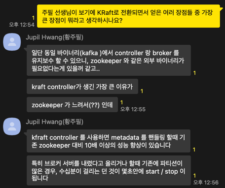
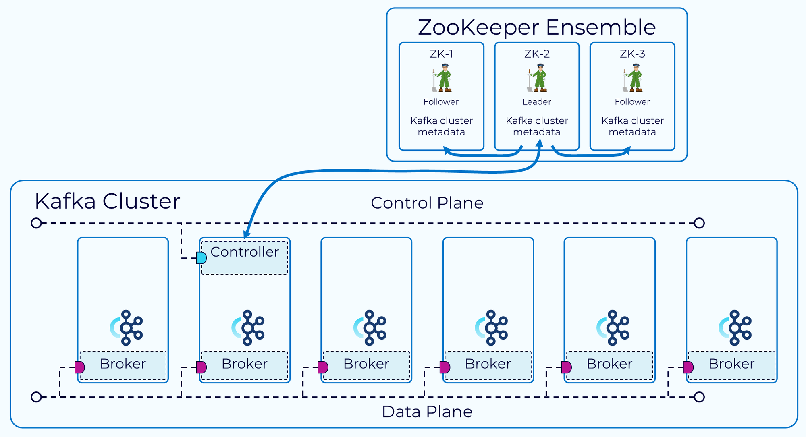
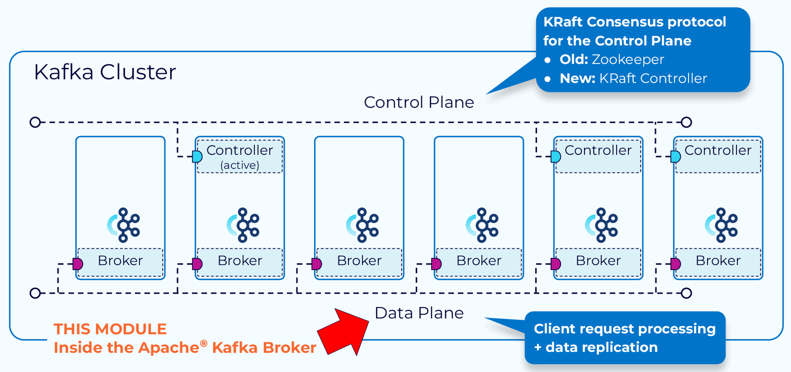
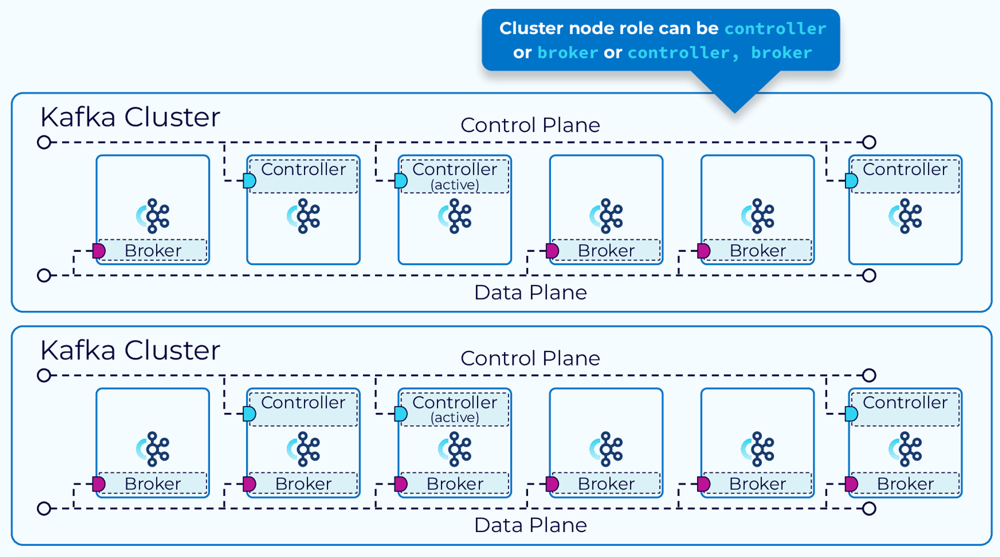
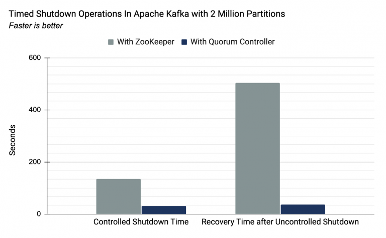

# Kafka의 KRaft Mode

> #### ZooKeeper가 Deprecated 되면서 Apache Kafka 4.0 부터 완전히 삭제된다고 한다. [[참고]](https://kafka.apache.org/documentation/#zk_depr) 그러면서 Kafka Cluster 메타데이터를 내부적으로 관리하는 KRaft Mode가 나왔다.  Confluent Korea의 황주필 선생님께서는 KRaft Mode의 장점을 아래와 같이 말씀하셨다.       그래서 ZooKeeper와 KRaft Mode의 차이를 알아보고자 한다. 

 

### Zookeeper Deprecated

위 그림과 같이 현재 Kafka는 ZooKeeper를 사용하여 파티션 및 브로커에 대한 메타데이터를 저장하고 브로커를 Kafka 컨트롤러로 선택한다.

하지만, Kafka에서는 위와 같은 역할을 하는 ZooKeeper에 대한 종속성을 제거하려고 한다. 
그 이유는 아래와 같다.

- ZooKeeper와 Kafka 컨트롤러의 상태가 일치하지 않는 경우가 종종 발생한다. 예를 들어, 파티션 리더가 변경되었을 때 그 정보가 컨트롤러에 반영되기까지 시간이 걸립니다.
- ZooKeeper는 별도의 시스템으로, Kafka와 다른 설정 파일, 관리 도구, 배포 패턴을 가지고 있어 관리가 복잡하다.

 

### KRaft Mode

 
위 그림과 같이 KRaft Mode가 도입되면서 Kafka Cluster의 메타데이터를 kafka 자체 토픽에 저장하여 관리한다.

 
위 그림과 같이 Kafka Cluster의 노드는 컨트롤러와 브로커의 역할을 동시에 할 수도 있고, 개별적으로 할 수도있다. 
(운영 단계에서는 개별적으로 사용하는 걸 권장하고 있다.)

 

### 성능 비교

위 그래프는 200만 개의 파티션이 있는 Kafka 클러스터에서 ZooKeeper와 KRaft 모드 간의 종료 및 복구 시간을 비교한 것이다.
- 종료했을 때 걸리는 시간 (좌측)
- 문제가 생겨서 종료 후 다시 실행 시켰을 때의 복구 시간 (우측)

---
---

#### [ Reference ]
- https://developer.confluent.io/courses/apache-kafka/events/?utm_medium=sem&utm_source=google&utm_campaign=ch.sem_br.brand_tp.prs_tgt.confluent-brand_mt.mbm_rgn.apac_lng.eng_dv.all_con.confluent-pricing&utm_term=confluent+pricing&_gl=1*186xyqv*_ga*MTQzMDE5NTk0LjE3MTQ3NDM5MTA.*_ga_D2D3EGKSGD*MTcxNjk2MjU3NC4xMC4xLjE3MTY5NjQ1NjcuNDIuMC4w&_ga=2.266384523.465425895.1716959115-143019594.1714743910&_gac=1.83625572.1716964563.CjwKCAjwgdayBhBQEiwAXhMxtpQXSjQXPRztJDPxHsI14uPec_HlDl1B626uM9AIV9HfGaPxWzzo3xoCnlcQAvD_BwE
- https://cwiki.apache.org/confluence/display/KAFKA/KIP-500%3A+Replace+ZooKeeper+with+a+Self-Managed+Metadata+Quorum
- https://docs.confluent.io/platform/current/kafka-metadata/kraft.html