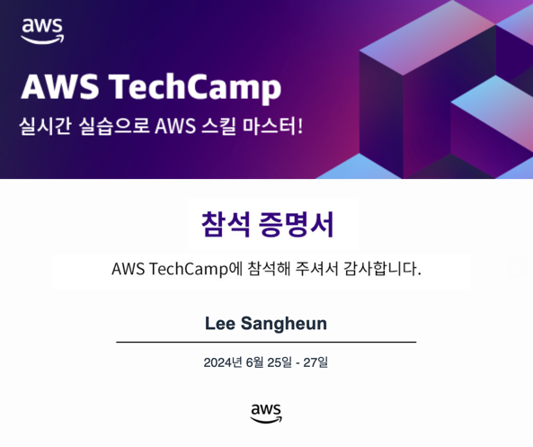
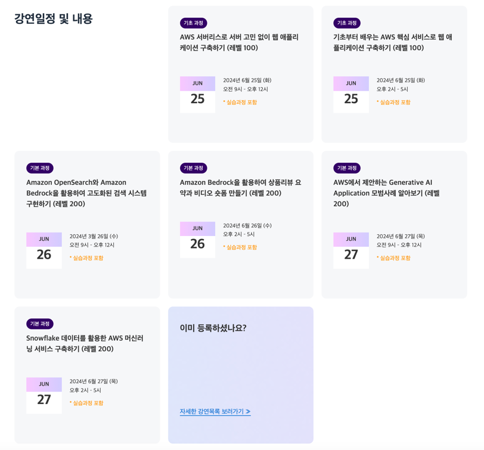
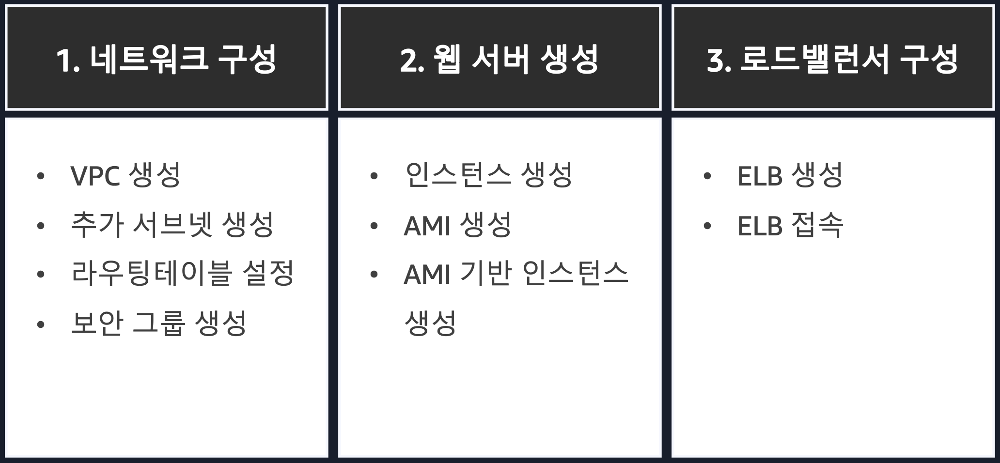
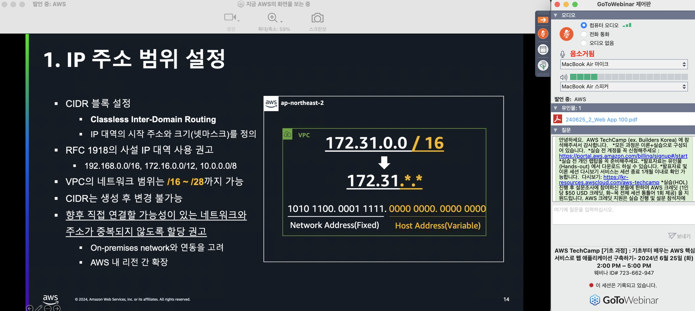
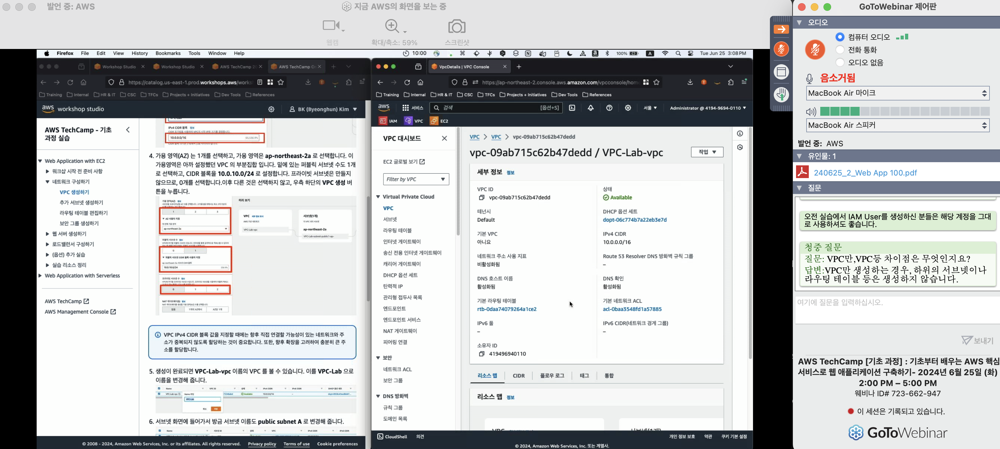
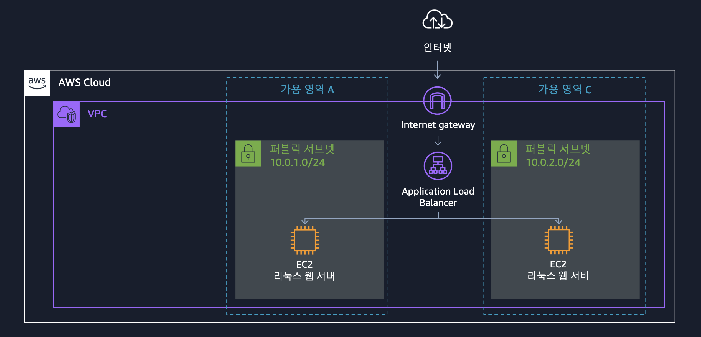

# AWS TechCamp 후기

> #### AWS TechCamp를 통해 "기초부터 배우는 AWS 핵심 서비스로 웹 애플리케이션 구축하기"를 수강한 후기를 남기려고 한다.  우선 해당 강의를 접하게 된 배경은 유튜브를 보다가 아래 썸네일을 지나치지 못해서 시작되었다.     

 

### 강연을 신청한 배경

 
여러가지 강연들이 있었지만, 나에게 가장 필요했던 건 "기초부터 배우는 AWS 핵심 서비스로 웹 애플리케이션 구축하기" 이 강연이었다. 

2년차 백엔드 개발자로 백엔드로서의 기초 지식을 어느정도 쌓은 후에 인프라적인 요소를 공부하자는 마인드로 그동안 좀 소홀히 했던 것 같다.
최근에 들어서야 어느정도의 백엔드 개발자로서의 지식을 얻은 것 같아서 슬슬 인프라를 알아야할 때가 된 것 같았는데 마침 강연이 있어서 강연 수강 등록을 했다.

 

### 커리큘럼

 
강연의 커리큘럼은 위와 같이 실습 위주로 구성되어 있다.

 
하지만, 실습을 바로 진행하는 것이 아니라 이렇게 자료를 통해 실습에서 다루는 기능에 대한 이론적인 설명을 하고나서 진행한다.

 
실습할 때도 누구나 따라하기 쉽게 자료를 제공해준다. 
※ 해당 자료는 강연을 신청한 사람만 볼 수 있게 되어 있다.

 

### 후기

 
실습을 통해 만든 아키텍처 구성도이다.

이 강연에서는 네트워크 구성, 웹 서버 생성, 로드밸런서 구성 등을 다루었다.
특히, VPC 생성, 추가 서브넷 생성, 라우팅 테이블 설정, 보안 그룹 생성 등을 직접 실습하면서 배우니 이해가 훨씬 더 잘 되었고,
덕분에 인프라에 대한 전반적인 이해와 감을 잡을 수 있었던 소중한 경험이었다.