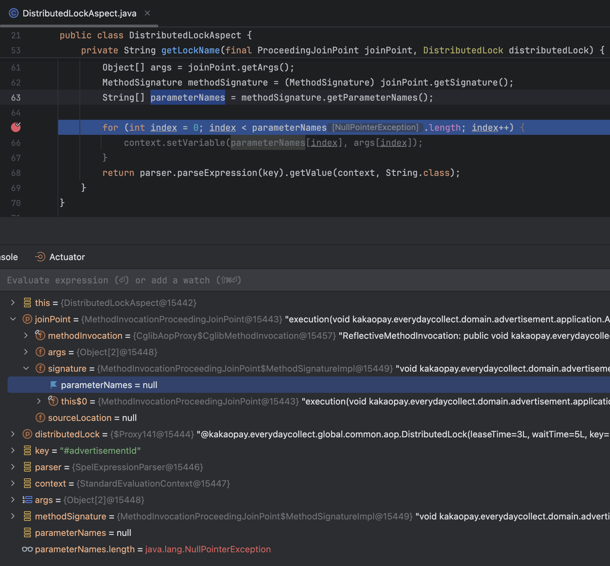
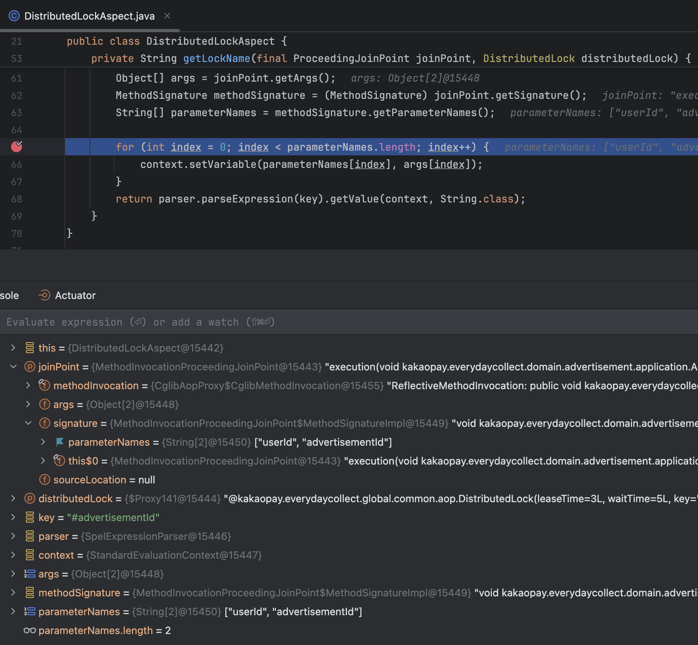

# 컴파일러가 오작동하는 문제가 발생했다

> #### Java 17, Spring Boot 3.3.1 환경에서 AOP와 Redis를 사용하여 분산락을 구현하던 중 마주친 컴파일러 문제를 **상황-원인-해결** 순으로 작성해 보려고 한다.  

 

### 상황

AOP와 Redis를 사용하여 분산락을 구현하던 중 메서드 파라미터의 값을 사용하여 동적으로 Lock Key를 사용하려고 했다. 근데 JoinPoint-MethodSignature-Parameter에 값이 Null인 문제가 발생했다.

 

### 원인

원인은 Spring Framework 6.1부터 `LocalVariableTableParameterNameDiscoverer`가 폐기되었기 때문이다. 

그러면 `LocalVariableTableParameterNameDiscoverer`란 도대체 무엇일까?

우선 Spring Core 모듈에 존재하는 `LocalVariableTableParameterNameDiscoverer`를 설명하기 전에 `javac 컴파일러`를 관련된 내용을 위주로 간단하게 설명하겠다.

> [ Javac 컴파일러 ] 
> Java 소스 파일(.java)을 컴파일하면 클래스 파일(.class)이 생성.java 코드를 컴파일하면 클래스 파일이 생성된다. 
> 클래스 파일(.class)에는 클래스 정보와 해당 클래스에 있는 메서드들의 정보들이 담겨있다. 
> (**하지만, 메서드에서 사용되는 `파라미터 이름`과 같은 정보는 없다.**)

Javac 컴파일러에 대한 정보는 위 내용만 알고 있어도 본문 내용을 이해하는 데 충분하다. 그러면 다시 이어서 얘기해보겠다.

클래스 파일(.class)에는 디버그 정보도 같이 저장하는데 `LocalVariableTableParameterNameDiscoverer`는 런타임에 디버그 정보를 파싱해서 메서드의 정보(파라미터 이름, 파라미터 타입 등)를 가져온다.
더 자세하게는 디버그 정보를 저장하는 구조체, 로컬 변수 테이블(Local Variable Table)를 파싱하는 것이다. 
※ 디버그: 디버깅 과정에서 프로그램의 실행 흐름을 쉽게 추적하고 분석할 수 있도록 돕기 위해서 저장하는 정보

하지만, `LocalVariableTableParameterNameDiscoverer`의 성능이 좋지 않다는 이유로 Spring Framework 6.1부터 폐기되었다. 
이에 대한 대안으로 Spring Framework 6.1부터는 컴파일러에 `-parameters`옵션을 추가하여 클래스 파일(.class)에 메서드 정보(파라미터 이름, 파라미터 타입 등)도 함께 저장하여 `StandardReflectionParameterNameDiscoverer`(리플렉션)을 사용하여 런타임에 파라미터 정보를 가져오는 방식을 권장한다.

 

### 해결

아래와 같은 방법을 사용하여 해결했다.

1. 소스 코드가 컴파일된 결과물(.class 파일 등)이 저장되는 out 폴더를 삭제한다. (Build & Run에 사용할 Build Tool로 Intellij를 사용하면 out 폴더에 .class 파일이 생성된다. / gradle로 설정하면 build 디렉토리에 생성된다.)
2. Intellij 기준 - Setting - Build, Execution, Deployment - Compiler - Java Compiler - Additional command line parameters - `-parameters` 추가
3. build.gradle.kts 기준 - `tasks.withType<JavaCompile>` - `options.compilerArgs.add("-parameters")` 추가

 

#### Reference
- https://github.com/spring-projects/spring-framework/issues/31675
- https://github.com/spring-projects/spring-boot/issues/38603
