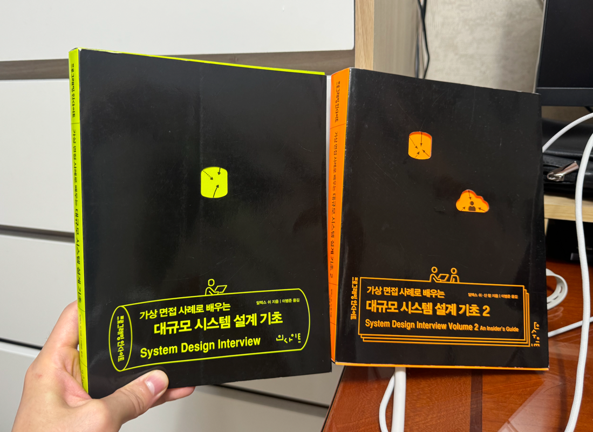
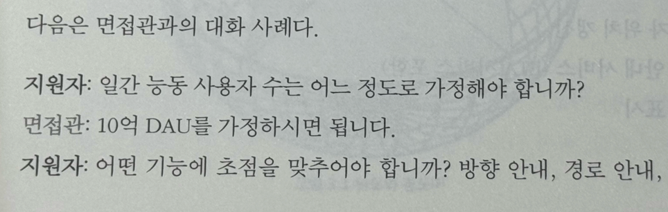

# 대규모 시스템 설계 기초 2 책을 구매했다

> #### 2024년 01월에 출시한 `가상 면접 사례로 배우는 대규모 시스템 설계 기초 2편` 책을 구매했다.   2021년 7월에 출시된 1편은 주변 개발자들 사이에서 매우 인기가 있었다. 그랬던 책의 2편이 출판되었다는 소식을 듣고 (좀 늦었지만, ㅎ) 바로 구매했다.  

 

### 책의 특징

1편과 마찬가지로, 2편도 가상의 면접 시나리오를 바탕으로 진행된다. 이를 통해 시스템 설계 면접에서 면접관과의 의사소통 방식, 요구사항을 풀어나가는 과정, 요구사항을 듣고 고민하는 과정 등을 알 수 있다.

 (예시)

 

### 책의 주제

**[ 2편에서는 총 13개의 면접 사례를 다룬다. 13개의 면접 사례를 정리하면 아래와 같다. ]**

- 지리적 위치 기반의 관계성 데이터를 저장하고 서비스할 때 발생하는 문제들
  - `1장: 근접성 서비스`
  - `2장: 주변 친구`
  - `3장: 구글 맵`

- 메시지 큐에 기반한 아키텍처가 실무에서 어떻게 활용될 수 있는지
  - `4장: 분산 메시지 큐`
  - `5장: 지표 모니터링 및 경보 시스템`

- 다량의 이벤트를 제때 정확히 처리하기 위해서 무엇을 고려해야 되는지
  - `6장: 광고 클릭 이벤트 집계`

- 예약 시스템 설계 시 고려해야 하는 문제들
  - `7장: 호텔 예약 시스템`

- 이메일처럼 오래된 기술을 대규모 서비스로 확장하는 것이 얼마나 도전적인 문제인지
  - `8장: 분산 이메일 서비스`

- 단순하게 시작한 클라우드 서비스가 어떻게 다양한 쓰임을 지원하는 복잡한 서비스로 발전할 수 있었는지
  - `9장: S3와 유사한 객체 저장소`

- 온라인 게임 서비스의 핵심 기술이 어떻게 구현되는지
  - `10장: 실시간 게임 순위표`

- 자금 흐름의 무결성을 어떻게 보장할 수 있는지
  - `11장: 결제 시스템`
  - `12장: 전자 지갑`
  - `13장: 증권 거래소`