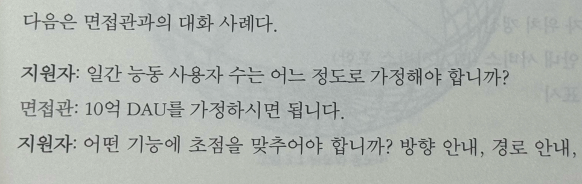

# 대규모 시스템 설계 기초 책을 구매했다

> #### `가상 면접 사례로 배우는 대규모 시스템 설계 기초` 책을 구매했다.   2021년 7월에 출시된 1편은 주변 개발자들 사이에서 매우 인기가 있었다. 그랬던 책의 2편이 출판되었다는 소식을 듣고 (좀 늦었지만, ㅎ) 1편과 2편을 같이 구매했다.  

 

### 리뷰

1편과 2편 모두 가상의 면접 시나리오를 바탕으로 진행된다. 이를 통해 시스템 설계 면접에서 면접관과의 의사소통 방식, 요구사항을 풀어나가는 과정, 요구사항을 듣고 고민하는 과정 등을 알 수 있다.

 (예시)

다양한 주제들이 있지만 아래 예시와 같이 흥미로운 주제들을 다루고 있다.

- 지리적 위치 기반의 관계성 데이터를 저장하고 서비스할 때 발생하는 문제들
- 메시지 큐에 기반한 아키텍처가 실무에서 어떻게 활용될 수 있는지
- 다량의 이벤트를 제때 정확히 처리하기 위해서 무엇을 고려해야 되는지
- 예약 시스템 설계 시 고려해야 하는 문제들

시간이 날 때마다 틈틈히 읽고 있다.

 

### 읽고나서

- [ID 생성 방법](2024.08.08%20-%20ID%20생성%20방법.md)