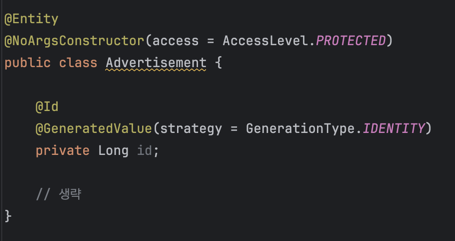

# ID 생성 방법

> #### 개발자인 친구가 아래 코드를 보고 왜 ID를 Long 타입으로 한거야? 라고 물었고 나는 대답을 하지 못 했다,,,  오늘은 다양한 ID 생성 방법과 그에 따른 장단점을 알아보자 ㅎㅎ   

 

### ID 생성 방법의 종류

#### 1. Auto Increment

Auto Increment는 데이터베이스 테이블에 새로운 레코드를 삽입할 때 고유한 기본 키 값을 자동으로 생성해주는 기능이다.
이를 통해 개발자는 기본 키를 수동으로 관리할 필요가 없으며, 숫자형 기본 키는 인덱스에서 빠른 비교와 정렬을 가능하게 해준다.
그러나 데이터베이스 서버가 여러 개 있는 환경에서는 중복된 기본 키가 발생할 수 있으며, 이를 피하기 위해 각 서버의 키 증가 규칙을 조정하면 숫자 순서와 실제 삽입 순서가 일치하지 않는 문제가 발생할 수 있다.

또한, 여러 데이터센터가 존재할 경우, 각 데이터센터에서 생성되는 기본 키가 중복되지 않도록 관리하는 것이 복잡해진다.
이는 분산된 환경에서의 일관성 문제로 이어질 수 있다.
더불어, 데이터베이스 서버를 추가하거나 삭제할 때, Auto Increment의 설정을 다시 조정해야 할 필요가 생기며, 이 과정에서 기본 키 값의 순서나 일관성에 문제가 발생할 수 있다.

#### 2. UUID

UUID(Universally Unique Identifier)는 기본 키로 사용될 수 있는 고유 식별자이다.
UUID는 128비트 크기로, 매우 큰 범위를 갖는다. 그래서 중복 UUID가 생성될 확률은 매우 낮다.
(초당 10억 개의 UUID를 100년 동안 생성해야만 중복이 발생할 가능성이 50%에 도달할 정도로 안전하다.)

그래서 UUID를 기본 키로 사용하는 경우, Auto Increment와 달리 데이터베이스 서버가 여러 개 있는 환경이나 여러 데이터센터에서 고유한 값을 쉽게 생성할 수 있다는 장점이 있다.
(데이터베이스 서버를 추가하거나 삭제할 때에도 일관된 기본 키 관리가 가능하다는 의미이다.)

그러나 UUID는 128비트로 크기가 커서, 데이터베이스 인덱스에 부하를 줄 수 있으며, 저장 및 검색 시 메모리와 디스크 공간을 더 많이 사용하게 된다.
또한, UUID는 시간순으로 정렬하기 어렵고, 숫자가 아닌 다양한 문자와 숫자의 조합으로 이루어져 있어 인덱스 비교와 정렬 성능이 숫자형 기본 키에 비해 떨어질 수 있다.
(UUID의 버전에 따라 시간순으로 정렬하는 문제는 부분적으로 해결할 수 있다. 예를 들어, UUID v1은 생성 시점의 타임스탬프를 포함하므로, 생성된 순서대로 정렬이 가능하다. 그러나, 일반적으로 중복 가능성이 가장 낮다고 여겨지는 UUID 버전은 UUID v4이다.)

#### 3. Snowflake

 

#### Reference
- todo