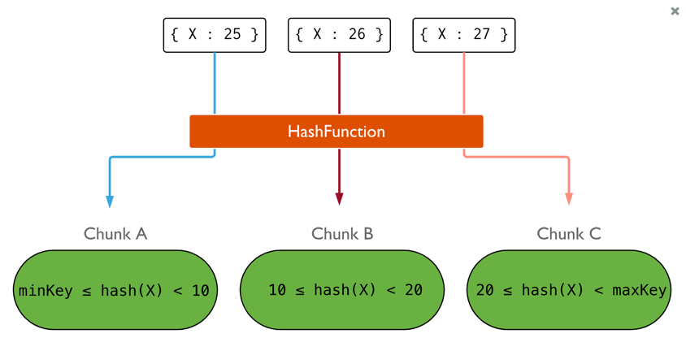

# MongoDB와 안정 해시

> #### MongoDB를 통해 안정 해시에 대해서 알아보려고 한다. 다루는 내용은 안정 해시를 이해하기 앞서 최소한의 MongoDB의 기능을 설명하고 이후 안정 해시에 대해서 ,,,, 

 

### MongoDB의 샤딩 방법

**범위 샤딩**

- **장점 :** 특정 범위에 대한 쿼리가 빠르게 처리될 수 있다.
- **단점 :** 샤딩 키의 분포가 불균형하여 핫스팟 문제가 발생할 수 있다.

**해시 샤딩**

- **장점 :** 데이터가 고르게 분배된다.
- **단점 :** 특정 범위에 대한 쿼리 효율성이 떨어질 수 있다.

 

### 안정 해시는 왜 필요할까?

> 실제 MongoDB에서는 Config 서버와 Mongos가 샤드의 추가 및 제거와 같은 작업을 관리하여 데이터 재분배 문제를 해결한다. 하지만, 상황을 단순화하여 MongoDB에서 이러한 관리가 자동으로 이루어지지 않는다고 가정한다.

 위 표는 Sharding key의 예시 데이터이다. 

 3개의 샤드가 존재한다고 가정했을 때, Sharding Key는 위와 같이 분배된다.

 만약 샤드 중 하나가 제거되었을 때, 위와 같이 Sharding Key는 재분배된다.

이러한 과정으로 Key2가 Shard 0으로 이동했지만, 백엔드 서버는 여전히 Shard 1에 요청을 보내는 현상이 발생할 수 있다.

 

### 안정 해시란?

---
---

#### [ Reference ]
- 가상 면접 사례로 배우는 대규모 시스템 설계 기초 1