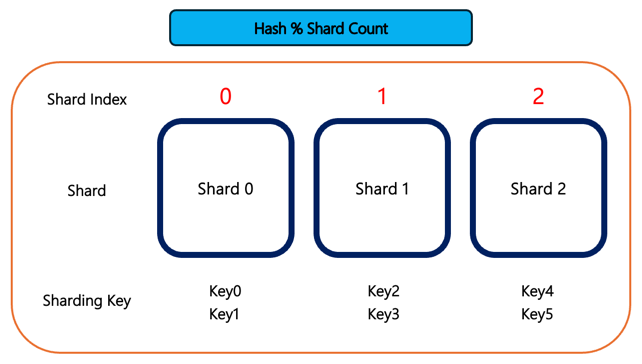
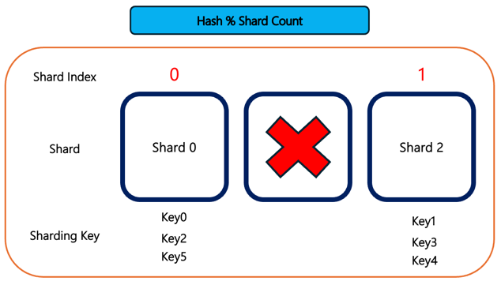

# 안정 해시와 MongoDB
 
> #### 안정 해시를 MongoDB의 샤드, 샤딩 관점에서 해시 링을 통해 설계하는 방법과 그 장점에 대해 알아보려고 한다. 이를 설명하기 위해, 먼저 간단하게 MongoDB의 샤딩을 알아본다.  참고로, MongoDB의 실제 샤딩 구조와 아래에서 다루는 해시 링은 직접적인 관련이 없으며, 이 설명은 단순히 비유로써 MongoDB를 사용하여 안정 해시를 설명하려는 것이다.

 

### MongoDB의 샤딩

샤딩 방법에는 `범위 샤딩`과 `해시 샤딩`이 있다. 아래에서 더 자세하게 살펴보자.

 (범위 샤딩) 
 (해시 샤딩)

**범위 샤딩**
- **장점 :** 특정 범위에 대한 쿼리가 빠르게 처리될 수 있다.
- **단점 :** 샤딩 키의 분포가 불균형하여 핫스팟 문제가 발생할 수 있다.

**해시 샤딩**

- **장점 :** 데이터가 고르게 분배된다.
- **단점 :** 특정 범위에 대한 쿼리 효율성이 떨어질 수 있다.

 

해시 샤딩을 예시로 샤드가 제거되었을 때, 샤딩 키의 재분배가 어떻게 이루어지는지 아래 예시를 통해 살펴보자

 

 위 표는 샤딩 키의 예시 데이터이다.

 

 3개의 샤드가 존재한다고 가정했을 때, 샤딩 키는 위와 같이 분배된다.

 

 만약 샤드 중 하나가 제거되었을 때, 위와 같이 샤딩 키는 `Hash % Shard Count`의 결과에 맞게 재분배된다.

 

### 안정 해시와 해시 링

안정 해시의 주된 목적은 노드(서버, 샤드) 추가 및 제거 시 발생하는 데이터 이동 비용을 줄여서 시스템의 성능 저하를 방지하고, 효율성을 높이는 것이다.

지금부터 안정 해시를 구현하는 가장 대표적인 방법인 해시 링에 대해 알아보자.

 

#### 해시 링
해시 링은 해시 값의 전체 범위를 원형으로 가정하여 배치하는 방식이다. 
예를 들어, SHA-1 해시 함수는 160비트 길이의 해시 값을 생성한다. 이 해시 값은 `0`부터 `2^160-1`까지의 범위를 갖는다.
해시 링에서는 `0` 이라는 최소값을 `hash 0`, `2^160-1`이라는 최대값을 `hash n`이라고 가정하고, 아래 그림과 함께 해시 링을 통해 안정 해시가 어떻게 동작하는지를 알아보자.

각 Key가 저장될 샤드는 해당 Key의 해시 값을 기준으로 해시 링을 시계 방향으로 탐색하여 만나는 첫 번째 샤드이다.
따라서, 위 그림에서 `Key 0`, `Key 1`은 `Shard 1`에 저장된다.

 

### 해시 링의 장점

해시 링의 주요 장점은 데이터의 재분배의 효율성이다.

위 그림을 보면 `Shard 2`가 제거되었을 때, `Shard 2`에 저장되어 있던 `Key 2`만 `Shard 0`으로 재배치하면 된다.
이러한 효율성은 샤드를 추가할 때에도 마찬가지로 적용된다.

 

---
---

 

#### [ Reference ]
- 가상 면접 사례로 배우는 대규모 시스템 설계 기초 1