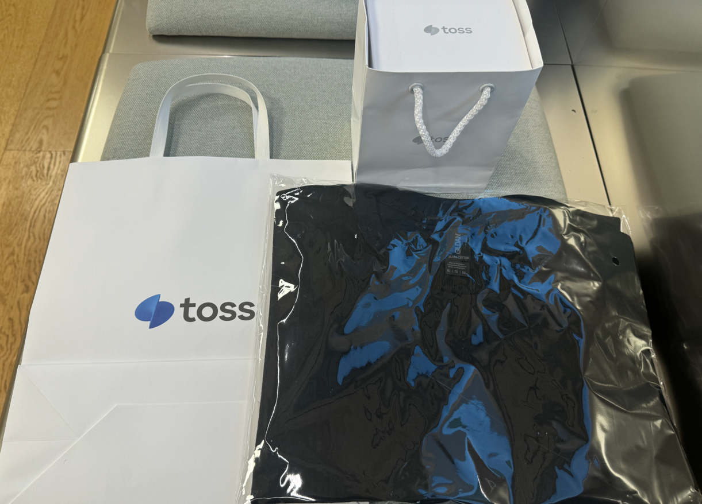
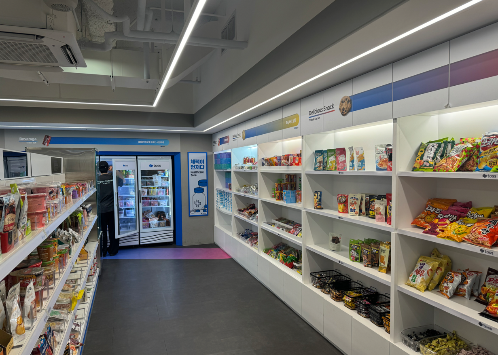
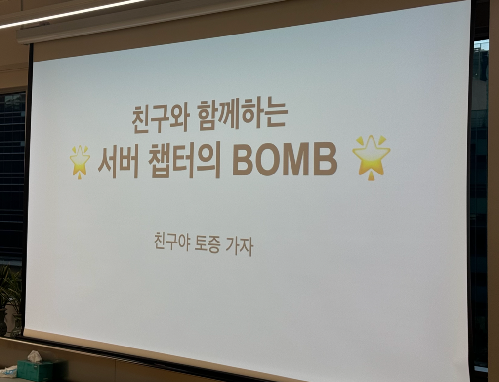
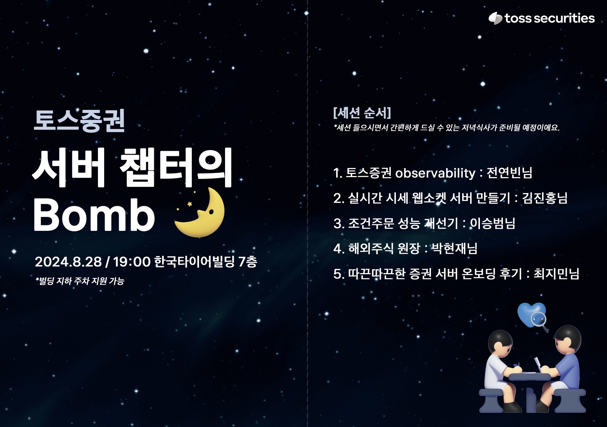

# 토스 증권 서버 챕터의 Bomb 후기

> #### 토스 증권에 근무하는 친구 덕분에 토스 증권의 내부 행사인 서버 챕터의 Bomb에 참석할 기회를 얻었다. 오늘은 그 행사에 다녀온 후기를 남겨보려고 한다.

 

### 후기

    
    

행사장에 도착하자마자 명찰과 함께 환영 선물을 받았다. 선물로는 티셔츠와 드립 커피가 준비되어 있었고, 행사에 초대해준 친구와 함께 사내 스낵바를 방문했다.

 

토스 증권의 스낵바는 웬만한 편의점 수준으로, 다양한 간식들이 준비되어 있었다. 더욱 놀라운 점은 이 모든 간식들이 직원들에게 무료로 제공된다는 사실이다!! 

 

    
    

간단히 간식을 챙기고 나니 어느덧 저녁 7시가 되어 세션이 시작되었다. 총 5개의 세션이 진행되었으며, 각 세션에서 다양한 주제들이 다루어졌다.

약 3시간 동안 진행된 행사였지만, 중간중간 재밌는 퀴즈 덕분에 지루할 틈이 없었다.
특히, 트러블 슈팅 해결 방법이나 증권 도메인과 관련된 기술 이야기가 흥미로웠다. 원래 주식에 대한 관심이 있었던 덕분에 더 몰입할 수 있었던 것 같다.

개인적인 생각이지만, 토스 증권 사람들은 정말 밝고 유쾌한 성격을 가진 것 같았다. 일에 대한 열정이 넘치고, 마치 젊은 날의 열정을 아낌없이 쏟아붓는 사람들처럼 보였다. 뭔가 "청춘" 드라마 속에 나오는 개발자? 아무튼 텍스트로 표현하기 애매한 그런 느낌을 받았던 것 같다.