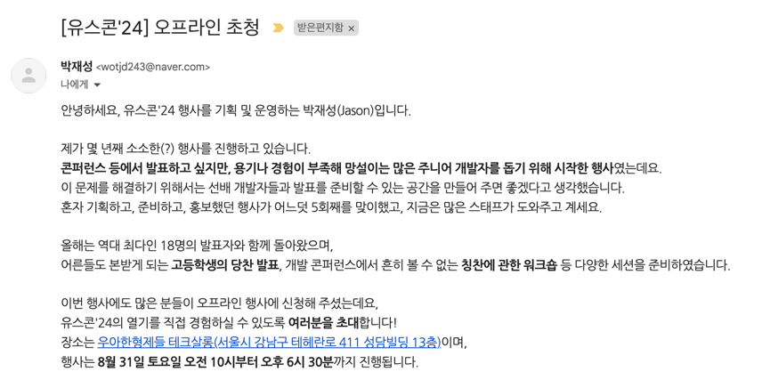
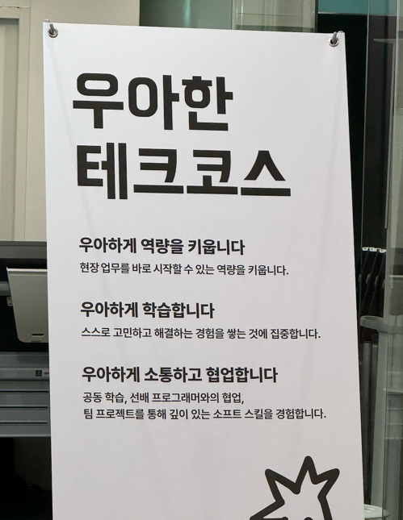
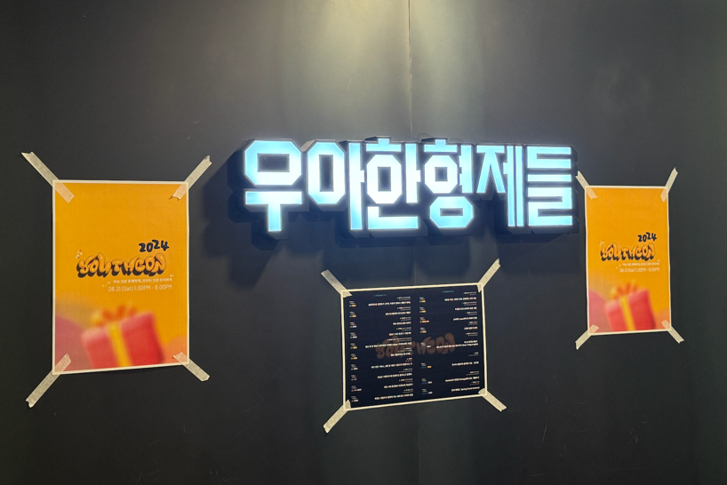
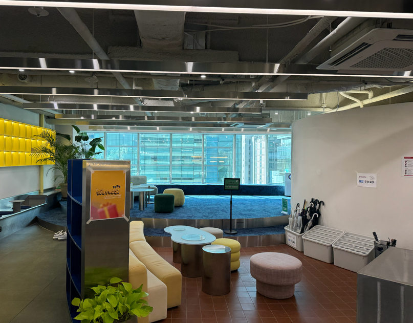
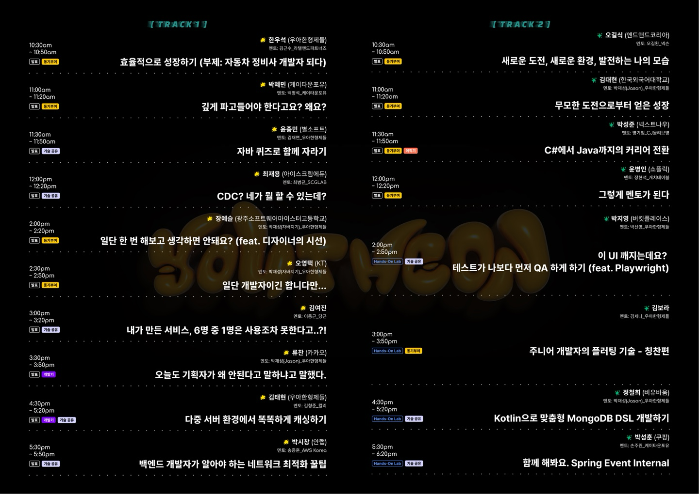
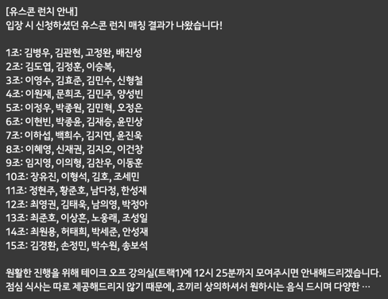

# 유쾌한 스프링방 컨퍼런스 2024 후기

> #### 유쾌한 스프링방 멤버는 아니지만, 관심 있는 세션이 있어 지원했는데 운 좋게 당첨되었다.  

 

### 후기

    
    

컨퍼런스는 우아한 테크 코스 선릉 캠퍼스에서 진행되었다.

 

로비에는 간단히 대화를 나눌 수 있는 공간들이 마련되어 있다.
동기부여 관련 세션이 많았는데, 개인적으로 그중 몇 개는 건너뛰고 로비에서 쉬면서 다른 참가자들과 대화를 나누었다.

 

여러 흥미로운 세션이 있었지만, 특히 `다중 서버 환경에서 똑똑하게 캐싱하기` 세션이 제일 궁금했었다.
이 세션에서는 음식점 데이터를 가져오기 위해 외부 API를 호출해야 하는 상황에서, 스프링 스케줄러를 사용해 폴링 방식으로 구현한 사례를 다루었다.
하지만, 스케일아웃 환경에서 여러 인스턴스가 폴링을 수행하게 되면서 데이터 동기화 문제가 발생했고, 이를 해결하기 위해 Lock을 사용한 사례까지 소개했다.

> 개인적으로 "배치를 사용했다면 스케일아웃으로 인한 동기화 문제가 애초에 발생하지 않았을 텐데?" 라는 생각이 들었다.

 

처음 참여한 유쾌한 스프링방 컨퍼런스라 매번 이런 프로그램이 있는지는 모르겠지만, 점심 시간에 새로운 사람들과 친해질 수 있도록 조를 짜주는 프로그램이 있었다.
세션도 매우 좋았지만, 다양한 사람들과 만나 시시콜콜한 이야기를 나눈 것이 참 즐거웠다.